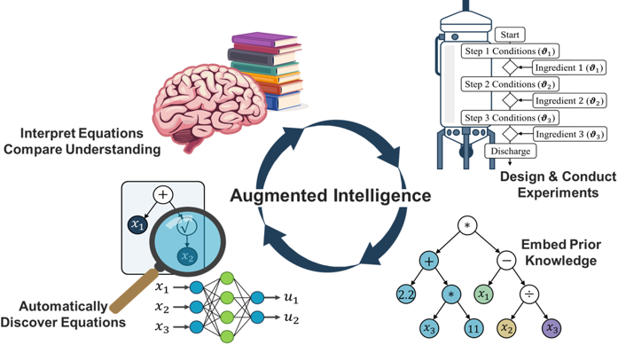
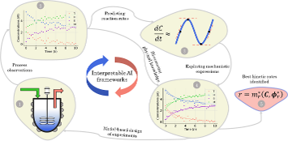

We combine interpretable AI with model-based experimental design to accelerate mechanistic understanding, reaction kinetics identification, and system knowledge discovery. This enables rapid process development and upscaling with minimal experimental trials.

