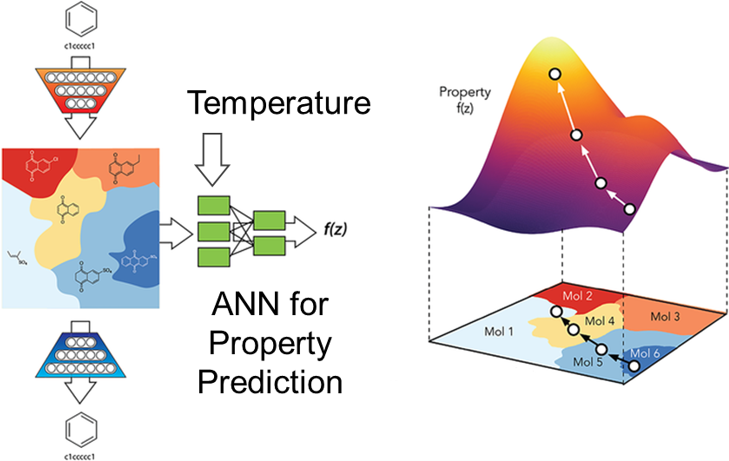
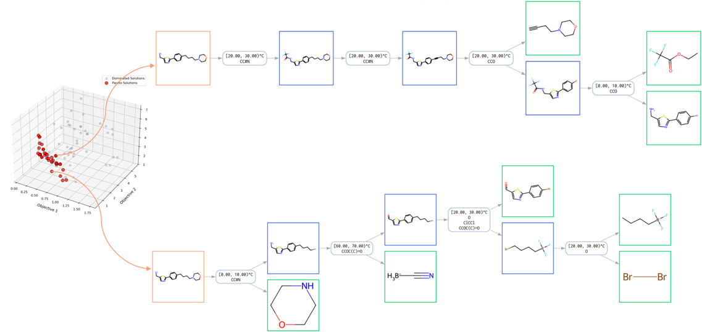

We develop generative and multimodal AI models to enable inverse design of formulations and materials with sustainability embedded from the outset. Our work also advances chemical property prediction and sustainable synthesis pathway planning for next-generation chemical products.

