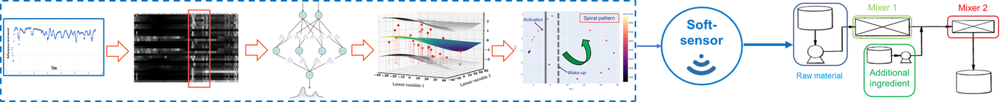
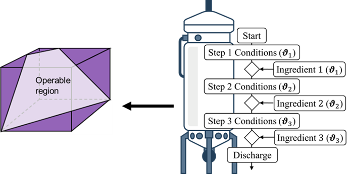

We apply data-driven and statistical modelling to extract actionable insights from industrial process data for monitoring, fault diagnosis, and predictive maintenance. Our methods support adaptive decision-making and operational space design to enhance flexibility, robustness, and quality by design.

