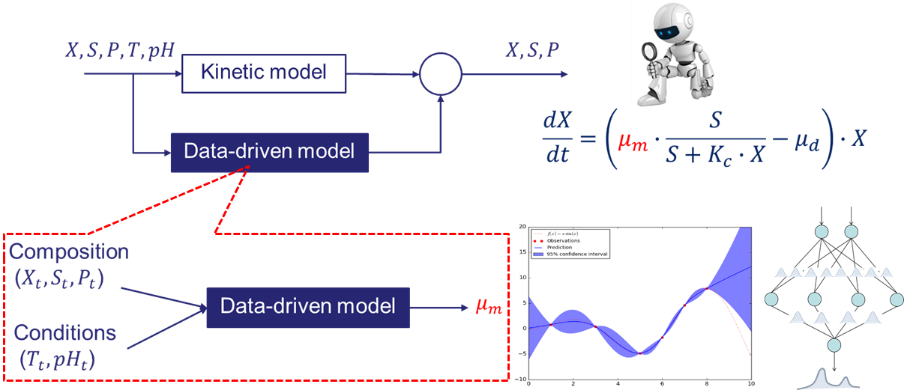
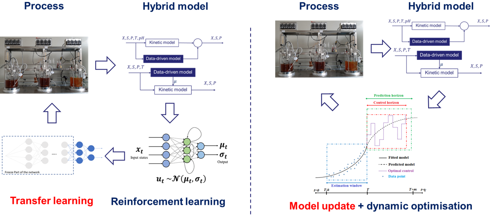

We develop predictive hybrid models that integrate physical knowledge with machine learning to represent complex chemical and biochemical systems. These models underpin dynamic optimisation and control strategies that improve process performance and robustness under uncertainty.

